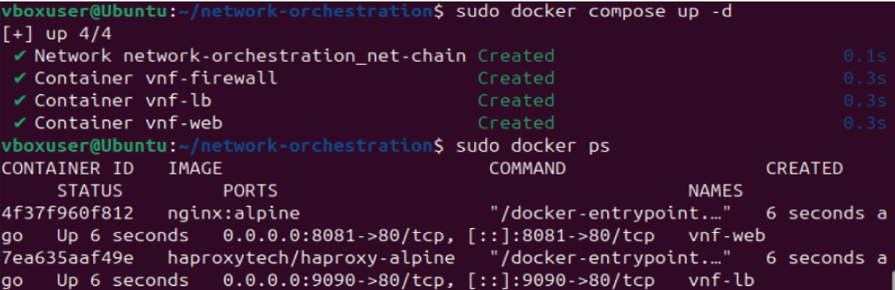
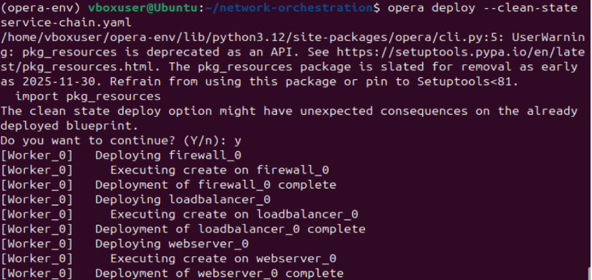
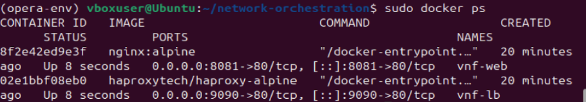
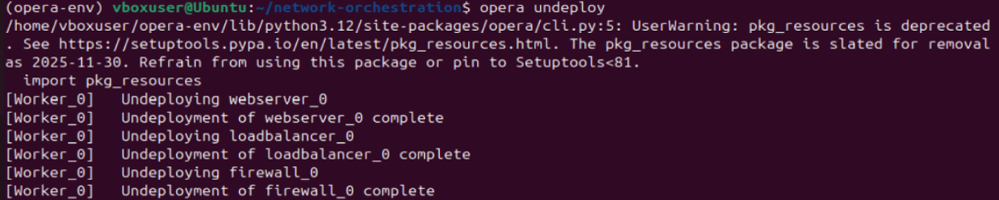
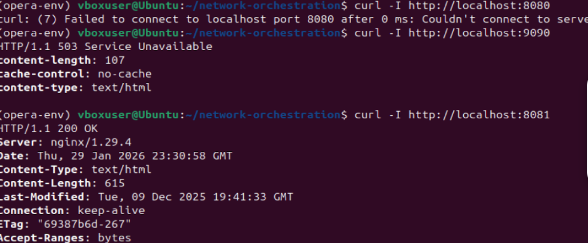

# TP-Orchestration-de-Services-R-seau


## 4. Étapes de réalisation

### 4.1 Déploiement conteneurs Docker
**Fichier `docker-compose.yml` :**

```yaml
services:
  firewall:
    image: wallarm/api-firewall
    container_name: vnf-firewall
    environment:
      - AFW_SERVER_LISTEN=8080
      - AFW_SERVER_ENDPOINT=http://vnf-lb:80
      - AFW_REQUEST_VALIDATION=false
      - AFW_SERVER_REPORT_ONLY=true
    ports:
      - "8080:8080"
    networks:
      - net-chain

  loadbalancer:
    image: haproxytech/haproxy-alpine
    container_name: vnf-lb
    ports:
      - "9090:80"
    networks:
      - net-chain

  webserver:
    image: nginx:alpine
    container_name: vnf-web
    ports:
      - "8081:80"
    networks:
      - net-chain

networks:
  net-chain:
    driver: bridge

```


* **Firewall** : point d'entrée unique de la chaîne de services. Il analyse le trafic entrant pour bloquer les requêtes malveillantes avant qu'elles n'atteignent l'infrastructure interne.
* **Load Balancer** : agit comme un orchestrateur. Distribue le trafic réseau entre plusieurs serveurs finaux pour éviter la saturation d'un seul point.
* **Web Server** :  Il héberge l'application.



### 4.2 Modélisation TOSCA

**Fichier `service-chain.yaml` :**

```yaml
tosca_definitions_version: tosca_simple_yaml_1_3

node_types:
  vnf_node:
    derived_from: tosca.nodes.Root

topology_template:
  node_templates:
    firewall:
      type: vnf_node
      interfaces:
        Standard:
          operations:
            create: playbooks/deploy_firewall.yaml

    loadbalancer:
      type: vnf_node
      requirements:
        - dependency: firewall
      interfaces:
        Standard:
          operations:
            create: playbooks/deploy_loadbalancer.yaml

    webserver:
      type: vnf_node
      requirements:
        - dependency: loadbalancer
      interfaces:
        Standard:
          operations:
            create: playbooks/deploy_webserver.yaml
```

Le modèle TOSCA structure notre chaîne de services. L’orchestrateur xOpera construit un Graphe Dirigé Acyclique pour ordonnancer le déploiement. Il interprète ces liens comme des contraintes de séquençage strictes, interdisant le lancement simultané des VNFs.


### 4.3 Orchestration avec xOpera








### 4.4 Workflow BPMN (Camunda) 

* **Deploy Firewall:** déclenche l'instanciation de la fonction de sécurité. Elle assure que le périmètre est défini avant l'exposition des autres services.
* **Deploy Load Balancer:** configure le répartiteur de charge pour préparer l'aiguillage du trafic vers les backends.
* **Deploy Web Server:** déploie l'application finale
* **Test Network Flow:** valide que la chaîne est traversante et que le service est rendu à l'utilisateur final.

Il ne manipule pas directement les conteneurs. Le lien s'effectue via des connecteurs ou des agents qui appellent les scripts Ansible. Le moteur attend un code de retour de ces scripts pour décider de la suite du workflow

### 4.5 Vérification du flux réseau 

* **curl http://localhost:8080:** L'orchestrateur a lancé la commande, mais le service n'a pas survécu à son initialisation.
* **curl http://localhost:9090 :** Le conteneur HAProxy est fonctionnel. Cependant, comme il est configuré pour rediriger le flux vers le firewall qui est hors-ligne, il renvoie une erreur.
* **curl http://localhost:8081**
  

* **log des conteneurs**
  


## 6. Analyse et discussion 
**Quelle est la différence entre orchestration TOSCA et workflow BPMN ?**
TOSCA est une approche déclarative. On décrit l'état final souhaité, l'orchestrateur déduit l'ordre technique des opérations. BPMN est une approche impérative et procédurale à l’inverse.

**Pourquoi séparer la logique de déploiement (xOpera) de la logique métier (Camunda) ?**
Par prnicipe de découplage. xOpera s'occupe de l'infrastructure, tandis que Camunda s'occupe de la logique métier. Cela permet de changer d'infrastructure sans modifier le processus métier global.

**Quels sont les avantages et limites de cette approche ?**
Permet de changer d'infrastructure sans modifier le processus métier global.Néanmoins cela engendre un surplus de consommation de ressources, plusieurs orchestrateurs tournent en parallèle.
